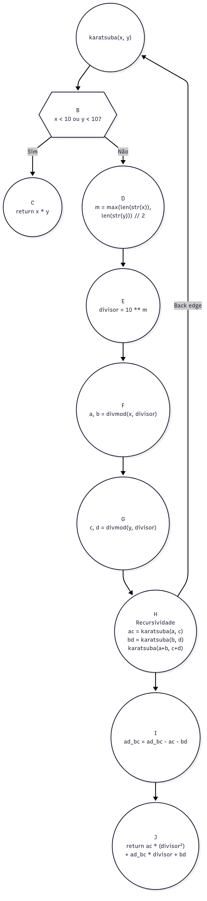

# Algoritmo de Karatsuba

## Descrição do Projeto

Este projeto implementa o **Algoritmo de Karatsuba**, um algoritmo eficiente para multiplicação de números inteiros grandes desenvolvido por Anatoly Karatsuba em 1960. O algoritmo utiliza a técnica de "dividir para conquistar" para reduzir a complexidade computacional da multiplicação tradicional.

### Funcionamento do Algoritmo

O algoritmo de Karatsuba baseia-se na seguinte ideia:

Para multiplicar dois números `x` e `y` de `n` dígitos:
1. Divide cada número em duas metades
2. Realiza três multiplicações recursivas ao invés de quatro
3. Combina os resultados usando operações de soma e deslocamento

**Fórmula matemática:**
```
x = a × 10^m + b
y = c × 10^m + d

x × y = ac × 10^(2m) + (ad + bc) × 10^m + bd
```

Onde `ad + bc` é calculado como `(a+b)(c+d) - ac - bd`.

### Explicação Linha a Linha do Código Simplificado

#### Função Principal `karatsuba(x, y)`:

**Linhas 2-3:** Caso base da recursão
```python
if x < 10 or y < 10:
    return x * y
```
Se algum dos números tem apenas 1 dígito, usa multiplicação tradicional.

**Linhas 5-6:** Cálculo do divisor
```python
m = max(len(str(x)), len(str(y))) // 2
divisor = 10 ** m
```
Calcula o ponto médio e determina o divisor para separar os números.

**Linhas 8-9:** Divisão eficiente dos números
```python
a, b = divmod(x, divisor)
c, d = divmod(y, divisor)
```
Usa `divmod()` para obter simultaneamente quociente e resto, dividindo cada número em partes alta e baixa de forma mais eficiente.

**Linhas 11-14:** Três multiplicações recursivas
```python
ac = karatsuba(a, c)
bd = karatsuba(b, d)
ad_bc = karatsuba(a + b, c + d)
ad_bc = ad_bc - ac - bd
```
Realiza as três multiplicações necessárias usando recursão (ao invés de quatro).

**Linha 16:** Combinação dos resultados
```python
return ac * (divisor ** 2) + ad_bc * divisor + bd
```
Aplica a fórmula de Karatsuba de forma direta, retornando o resultado final.

#### Função Auxiliar:

**`main()`:** Função de demonstração que executa os casos de teste para verificar o funcionamento do algoritmo.

## Como Executar o Projeto

### Pré-requisitos

- Python 3.6 ou superior instalado no sistema
- Nenhuma biblioteca externa é necessária (usa apenas bibliotecas padrão)

### Instruções de Execução

1. **Clone ou baixe o repositório:**
   ```bash
   git clone https://github.com/robinCrobin/algoritmo-karatsuba.git
   cd algoritmo-karatsuba
   ```

2. **Execute o programa principal:**
   ```bash
   python3 main.py
   ```

3. **Execução personalizada:**
   ```python
   from main import karatsuba
   
   resultado = karatsuba(1234, 5678)
   print(f"Resultado: {resultado}")
   ```

### Saída Esperada

O programa executará automaticamente uma série de testes demonstrando o algoritmo de Karatsuba, cobrindo todos os caminhos possíveis:

```
ALGORITMO DE KARATSUBA
========================================
5 × 7 = 35
9 × 123 = 1107
456 × 8 = 3648
12 × 34 = 408
123 × 456 = 56088
1234 × 5678 = 7006652
123456789 × 987654321 = 121932631112635269
```

## Relatório Técnico

### Análise da Complexidade Ciclomática

#### Grafo de Fluxo de Controle

O grafo de fluxo de controle da função `karatsuba` pode ser representado pelo seguinte diagrama:



O grafo também pode ser representado pelos seguintes nós e arestas:

**Nós:**
1. **A** - Entrada da função `karatsuba(x, y)`
2. **B** - `if x < 10 or y < 10:`
3. **C** - `return x * y`
4. **D** - `m = max(len(str(x)), len(str(y))) // 2`
5. **E** - `divisor = 10 ** m`
6. **F** - `a, b = divmod(x, divisor)`
7. **G** - `c, d = divmod(y, divisor)`
8. **H** - `Recursividade` 
9. **I** - `ad_bc = ad_bc - ac - bd`
10. **J** - `return ac * (divisor ** 2) + ad_bc * divisor + bd`

**Arestas:**
1. - A → B (Início → Verificação)
2. - B → C (Verificação → Caso Base, se condição verdadeira)
3. - B → D (Verificação → Cálculo de m, se condição falsa)
4. - D → E (Cálculo de m → Cálculo do divisor)
5. - E → F (Cálculo do divisor → divmod x)
6. - F → G (divmod x → divmod y)
7. - G → H (divmod y → Recursividade)
9. - H → A (Recursividade → Início)
9. - H → I (Recursividade → Cálculo em cima de ad_bc)
10. - I → J (Cálculo em cima de ad_bc → Combinação/Return)

#### Cálculo da Complexidade Ciclomática
**M = E - V + 2P**
**M = 10 - 10 + 2(1) = 2**
#### Complexidade Ciclomática: M = 2

**2 caminhos independentes:**
1. Caso base (x < 10 ou y < 10)
2. Caso recursivo (números grandes)

#### Temporal: O(n^1.585)

**Melhor, Médio e Pior Caso:** O(n^1.585)
- Sempre mais eficiente que O(n²) tradicional
- Vantagem aumenta com números maiores

#### Espacial: O(n)

#### Recorrência: T(n) = 3T(n/2) + O(n) = O(n^1.585)
